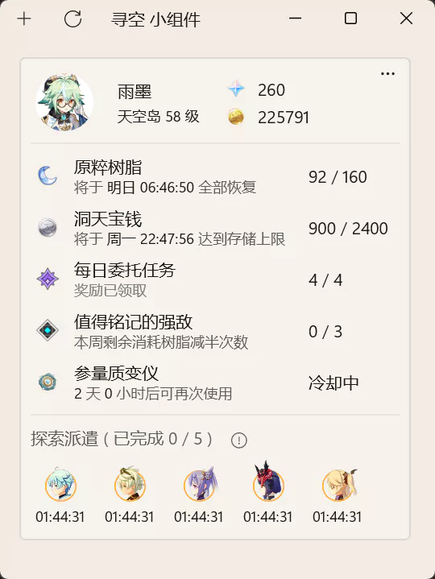
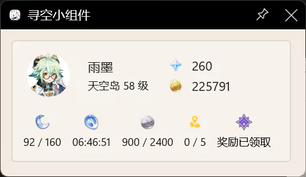

# 寻空 小组件

> 系统升 Win11 了，没有磁贴很不适应，遂把主意打向了 Xbox Game Bar

支持 **普通窗口** 和 **Xbox Game Bar** ，暂不支持 **Win10 磁贴** ，没有更新提醒。

有大佬能教教我 **UWP的定时器后台任务** 怎么写吗，搞定这个就能支持磁贴了。

### 使用方法

懂得都懂，不懂的看 [这个](https://xunkong.cc/help/desktop/account.html)

### 截图

**普通窗口**

**Xbox Game Bar**

